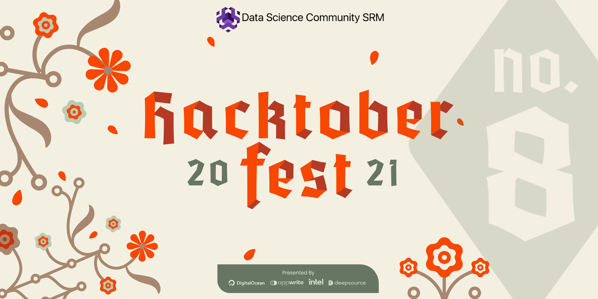

 

| Repositories                                                                                           | Issues                                                                                                                                                                                                                                  | Stars                                                                                                                                                                                                                                | Forks                                                                                                                                                                                                                     | Languages                     |
| ------------------------------------------------------------------------------------------------------ | --------------------------------------------------------------------------------------------------------------------------------------------------------------------------------------------------------------------------------------- | ------------------------------------------------------------------------------------------------------------------------------------------------------------------------------------------------------------------------------------ | ------------------------------------------------------------------------------------------------------------------------------------------------------------------------------------------------------------------------- | ----------------------------- |
| [Resourceify](https://github.com/Data-Science-Community-SRM/Resourceify)                               |                                |                                |                                | All Languages                 |
| [DocGen](https://github.com/Data-Science-Community-SRM/DocGen)                                         |                                          |                                          |                                          | Preact, HTML, CSS, Javascript |
| [Awesome Jupyter Notebooks](https://github.com/Data-Science-Community-SRM/Awesome-Jupyter-Notebooks)   |    |    |    | Python, R, jupyter            |
| [Algorithms for programming](https://github.com/Data-Science-Community-SRM/algorithms-for-programming) |  |  |  | C, C++, Python                |

 

<h1>
 What is Hacktoberfest 2021? 
</h1>

Hacktoberfest is the easiest way to get into open source! Hacktoberfest is a month long celebration of open source code presented by Digital Ocean.

During the entire month of October 2021, all you have to do is contribute to any open source project with the hacktoberfest tag and open at least 4 pull requests which follow the [Hacktoberfest guidelines](https://hacktoberfest.digitalocean.com/hacktoberfest-update?updated). It can be any project mentioned above and you can contribute in any way possible. It can be a be a bug fix, optimisation, feature addition or even a documentation enhancement!

If you’ve never contributed to open source before, this is the perfect time to get started because Hacktoberfest provides a large list of available contribution opportunities.

<h1>
How to get Started? 💥 
</h1>

Click on the link to register yourself [here](https://hacktoberfest.digitalocean.com/).

<h1>Why should you take part? 🙌 </h1>

- Chance to contribute to awesome open source projects.
- Polish you GitHub Skills.
- Free swags and T-Shirts from Digital Ocean
- Chance to get a tree planted and make Earth greener

# Contribution Guidelines 🙂

- When contributing to the repositories, please first discuss the change you wish to make via issue, email, or any other method with the maintainers of this repository before making a change.
- Don't forget to get yourself assigned before starting to work to avoid any clashes & confusion.

## Pull Request Process

- Ensure any install or build dependencies are removed before the end of the layer when doing a build.
- Update the README.md with details of changes to the interface- this includes new environment variables, exposed ports, useful file locations and container parameters.
- Only send your pull requests to the development branch where once we reach a stable point it will be merged with the master branch.
- Associate each Pull Request with the required issue number.
- Please provide relevant steps to use your codebase adding few extra lines of comments or commands to run would be helpful for others to follow along.

## Branch Policy

- development: If you are making a contribution make sure to send your Pull Request to this branch. All developments goes in this branch.
- master: After significant features/bug-fixes are accumulated in development branch we will merge it with the master branch.

## Contribution Practices

- Please be respectful of others, do not indulge in unacceptable behaviour
- If a person is working or has been assigned an issue and you want to work on it please ask him/her if he is working on it
- We are happy to allow you to work on your issues, but in case of long period of inactivity the issue will be approved to another volunteer
- If you report a bug please provide steps to reproduce the bug.
- In case of changing the backend routes please submit an updated routes documentation for the same.
- If there is an UI related change it would be great if you could attach a screenshot with the resultant changes so it is easier to review for the maintainers
<h1> Maintainers </h1>

<table align="center">
<tr align="center">

 <td>

Rakesh J

</td>
 
<td>

Hritik Bhandari

</td>

<td>

Akshat Anand

</td>

<td>

Gayathri Seetharaman

</td>
</tr>
</table>

